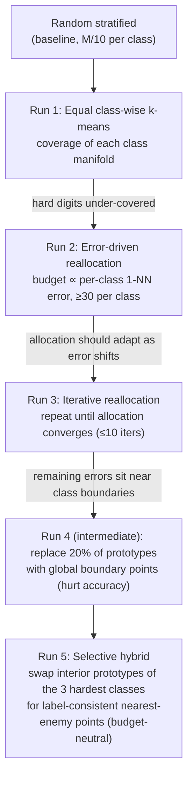

# 1NN-Prototype-Selection

**Shrinking MNIST's 60,000-image training set to a small set of prototypes for 1-nearest-neighbor classification. With only 100 prototypes, coverage-oriented class-wise k-means reaches 79.6% accuracy, against 65.6% for random sampling.**

The full technical write-up (methods, ablations, per-class analysis) is in [`report.pdf`](report.pdf).

---

## Overview

1-NN classification is simple and strong, but every prediction scans the whole training set, so cost and memory grow linearly with it. *Prototype selection* replaces the training set with a small subset of **M** representative examples. The aim is to keep as much accuracy as possible while cutting the stored set by 6× to 600×.

This repo implements and compares five strategies on MNIST, with 60k training and 10k test images represented as 784-dimensional pixel vectors. The budgets are M ∈ {100, 200, 500, 1000, 2000, 5000, 10000}.

## What I built

- **A prototype-selection library** (`prototype_selection.py`): a binary MNIST loader, class-wise k-means with arbitrary per-class budgets that snaps each centroid to its nearest real training image, a stratified random baseline, per-class 1-NN evaluation, error-proportional budget reallocation with a minimum-per-class constraint, an iterative reallocation loop with a convergence check, nearest-enemy search, and two boundary-aware refinement schemes.
- **A CLI selector** (`select_prototypes.py`): picks M prototypes with any method, reports the 1-NN test accuracy, and can export the prototypes as `.npz`. It is also importable as `PrototypeSelector`.
- **An experiment harness** (`run_experiments.py`): runs all five methods for a given M. The random baseline is repeated over 10 seeds (mean ± std) and the k-means methods use a fixed seed. Writes overall and per-class accuracies to a TSV.
- **Plots and analysis** (`plot_results.py`, `plot_per_class_results.py`, report): accuracy-vs-budget curves and per-class breakdowns, with the trade-offs between methods discussed in the report.

## Methods

The design is iterative: each method was motivated by a failure mode of the previous one.



| Method | `--method` | Idea |
|---|---|---|
| Random stratified | `random` | Equal random draw per class |
| Run 1: Equal k-means | `equal-kmeans` | k-means inside each class with M/10 clusters; each centroid is replaced by the nearest real image |
| Run 2: Error-driven | `error-driven` (default) | Run 1, measure per-class error, reallocate the budget in proportion to error (min 30 per class), re-cluster |
| Run 3: Iterative | `iterative` | Repeat Run 2 until the largest allocation change is ≤ 0.001 or 10 iterations |
| Run 5: Selective hybrid | `selective-hybrid` | Run 3, then for the 3 highest-error classes replace the most "interior" prototypes with boundary points (smallest nearest-enemy distance, with a local label-consistency filter) |

Run 4, the naive global boundary replacement, exists as `boundary_aware_refinement()` in `prototype_selection.py`. The report describes it as an intermediate experiment that reduced accuracy. It is not exposed in the CLI.

## Results

1-NN test accuracy on the 10,000 MNIST test images. Source: [`results/results_M*.tsv`](results/), which matches Table 1 of the report. Random stratified is the mean ± std over 10 seeds; the other methods are single runs with seed 42.

| Method | M=100 | M=200 | M=500 | M=1000 | M=2000 | M=5000 | M=10000 |
|---|---|---|---|---|---|---|---|
| Random stratified | 0.6555 ± 0.0202 | 0.7335 ± 0.0120 | 0.7980 ± 0.0062 | 0.8388 ± 0.0035 | 0.8650 ± 0.0035 | 0.8972 ± 0.0027 | 0.9146 ± 0.0026 |
| Run 1: Equal k-means | **0.7962** | **0.8206** | 0.8553 | 0.8749 | 0.8972 | 0.9091 | 0.9187 |
| Run 2: Error-driven | **0.7962** | **0.8206** | 0.8555 | 0.8849 | **0.9030** | 0.9141 | 0.9242 |
| Run 3: Iterative | 0.7918 | 0.8191 | **0.8619** | **0.8855** | 0.8995 | **0.9158** | **0.9247** |
| Run 5: Selective hybrid | 0.7915 | 0.8177 | 0.8591 | 0.8833 | 0.8977 | 0.9143 | 0.9226 |

<p align="center"></p>

<p align="center"></p>

**Takeaways**

- **Coverage matters most at small budgets.** At M=100, class-wise k-means beats random sampling by 14 points (79.6% vs 65.6%). At M=10,000 the gap between random sampling and the best method shrinks to about 1 point (91.5% vs 92.5%).
- **Error-driven allocation helps once the budget is large enough.** At M=100 and M=200, the 30-per-class minimum (300 in total) exceeds M. The code then falls back to equal allocation, so Run 2 is identical to Run 1. From M=1000 upward, Run 2 adds 0.5 to 1 point over Run 1.
- **Iterating gives only marginal gains, at roughly 10× the runtime of single-pass reallocation** (per the report). Run 3 has the best accuracy at 4 of the 7 budgets, but Run 2 is the better accuracy/compute trade-off.
- **Boundary augmentation did not pay off on MNIST.** Run 5 is slightly below Run 3 at every budget, so centroid coverage already captures most of the structure that 1-NN can use.
- **Per-class:** digit 1 is easy for every method. Digits 2, 4, 5 and 7 gain the most from structured selection at low M: about 19 to 21 points over random sampling at M=100 (Run 1).

**Caveat on evaluation.** In this course setup (Algorithms 2 to 4 in the report), the per-class errors that drive reallocation in Runs 2, 3 and 5 are computed on the **MNIST test set**. Their accuracies are therefore optimistically biased compared with Run 1 and the random baseline. A clean protocol would estimate per-class errors on a validation split carved from the 60k training images. That change is small (pass a validation split as `X_test`/`y_test` to the selection functions and evaluate separately), but it has not been run here.

## Getting started

### 1. Install

```bash
git clone https://github.com/sergimarsol/1NN-Prototype-Selection.git
cd 1NN-Prototype-Selection
python3 -m venv .venv && source .venv/bin/activate
pip install -r requirements.txt
```

### 2. Get MNIST

Place the four uncompressed IDX files in an `archive/` folder (git-ignored) with these exact names, which `prototype_selection.load_mnist_binary` expects:

```
archive/
├── train-images.idx3-ubyte
├── train-labels.idx1-ubyte
├── t10k-images.idx3-ubyte
└── t10k-labels.idx1-ubyte
```

Use `--archive /path/to/folder` to point to a different location.

### 3. Select prototypes

```bash
python select_prototypes.py --M 1000                               # error-driven (default)
python select_prototypes.py --M 500 --method random
python select_prototypes.py --M 2000 --method equal-kmeans
python select_prototypes.py --M 5000 --method iterative --normalize
python select_prototypes.py --M 10000 --method selective-hybrid --normalize
python select_prototypes.py --M 1000 --method error-driven --output prototypes_1000.npz
```

| Flag | Default | Description |
|---|---|---|
| `--M` | *required* | Number of prototypes |
| `--method` | `error-driven` | `random`, `equal-kmeans`, `error-driven`, `iterative`, `selective-hybrid` |
| `--archive` | `archive` | Folder with the MNIST IDX files |
| `--seed` | `42` | Random seed (k-means and random sampling) |
| `--output` | none | Save `X_proto`, `y_proto` to a `.npz` file |
| `--normalize` | off | Apply `StandardScaler` after scaling pixels to [0, 1] |

The script prints the data shapes, the number of selected prototypes, the per-class prototype counts, and `1-NN Test Accuracy: …`. Pixels are always scaled to [0, 1]. `run_experiments.py` always applies `StandardScaler`, so pass `--normalize` to match the reported setup.

Load saved prototypes:

```python
import numpy as np
data = np.load("prototypes_1000.npz")
X_proto, y_proto = data["X_proto"], data["y_proto"]
```

Use it as a module with data already in memory:

```python
from select_prototypes import PrototypeSelector
selector = PrototypeSelector(X_train, y_train, X_test, y_test, random_state=42)
X_proto, y_proto = selector.select_prototypes(M=1000, method="error-driven")
```

### 4. Reproduce the experiments

```bash
for M in 100 200 500 1000 2000 5000 10000; do
  python run_experiments.py --M $M        # writes results_M${M}.tsv to the current directory
done
python plot_results.py                    # -> results_plot.png
python plot_per_class_results.py          # -> per_class_results_plot.png
```

`run_experiments.py` takes `--M` (default 1000), `--archive` (default `archive`) and `--seed` (default 42). The selective-hybrid runs at large M are the slowest because of the nearest-enemy search over all 60k training points. The two plotting scripts contain the accuracy values from `results/` hard-coded, so update their arrays if you re-run the experiments.

## Tech stack

Python · NumPy · scikit-learn (KMeans, KNeighborsClassifier, NearestNeighbors, StandardScaler) · Matplotlib

## Repository structure

```
prototype_selection.py      # algorithm library: loader, k-means selection, reallocation, boundary refinement
select_prototypes.py        # CLI + PrototypeSelector class
run_experiments.py          # full experiment harness -> results_M{M}.tsv
plot_results.py             # accuracy vs M plot
plot_per_class_results.py   # per-class accuracy plot (M=100 vs M=10000)
results/                    # TSV results for all 7 budgets + figures
report.pdf                  # technical report
requirements.txt
```

## Acknowledgements

Developed at UC San Diego (CSE 251A, Winter 2026). The methods build on the prototype-selection literature cited in the report: García et al., 2012 (*IEEE TPAMI*); Vascon et al., 2013; Plasencia-Calaña et al., 2017. As stated in the report's AI usage statement, AI tools helped with code formatting and comments, the README, and writing polish.

## License

[MIT](LICENSE) © 2026 Sergi Marsol
